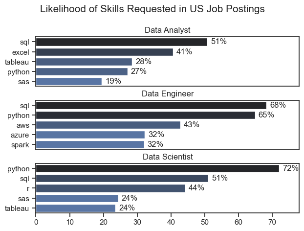
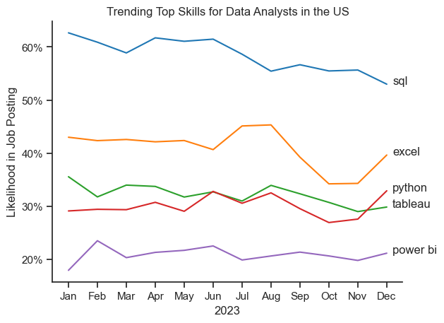
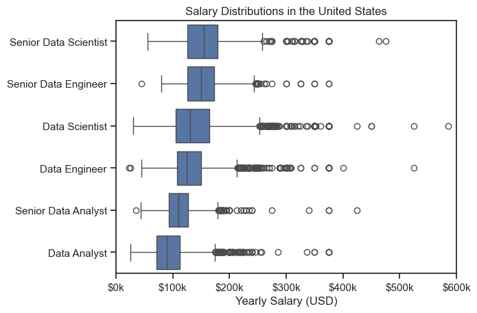
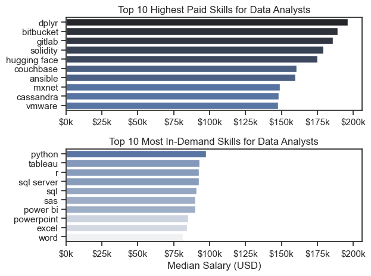
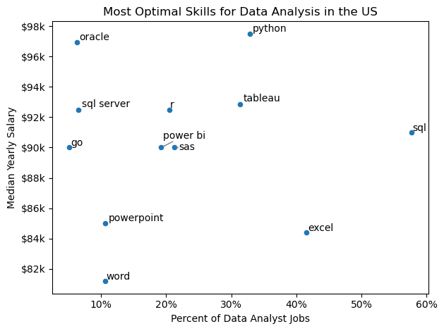

# Overview

Welcome to my analysis of the data job market, focusing on the data analyst roles. This project was created out of a desire to navigate and understand the job market more effectively. It delves into the top-paying and in-demand skills to help find optimal job opportunities for data analysts.

The data sourced from Luke's Python Course which provides a foundation for my analysis, containing detailed information on job titles, salaries, locations, and essential skills.Through a series of Python scripts, i explore key questions such as the most demanded skills, salary trends, and the intersection of demand and salary in data analytics.

# The Questions 

Below are the questions i want to answer in my project:

1. What are the skills most in demand for the top 3 most popular data roles?
2. How are in-demand skills trending for Data Analysts?
3. How well do jobs and skills pay for Data Analysts?
4. What are the optimal skills for data analysts to learn? (High Demand and High Paying)

# Tools I Used 

For my deep dive into the data analyst job market, i harnessed the power of several key tools:

- **Python**: The backbone of my analysis, allowing me to analyze the data and find critical insights. I also used the following Python libraries:
1. **Pandas Library**: This was used to analyze the data.
2. **Matplotlib Library**: I visualized the data.
3. **Seaborn Library**: Helped me create more advanced visuals.

- **Jupyter Notebooks**: The tool i used to run my Python scripts which let me easily include my notes and analysis.
- **Visual Studio Code**: My go-to for executing my Python scripts.
- **Git & GitHub**: Essential for version control and sharing my Python code and analysis, ensuring collaboration.

# Data Preparation and Cleanup

This section outlines the steps taken to prepare the data for analysis, ensuring accuracy and usability.

## Import & Clean Up Data 

I start by importing necessary libraries and loading the dataset, followed by initial data cleaning tasks.

# The Analysis

## 1. What are the most demanded skills for the top 3 most popular data roles?

To find the most demanded skills for the top 3 most popular data roles. I filtered out those positions by which ones were the most popular, and got the top 5 skills for these top 3 roles. This query highlights the most popular job titles and their top skills, showing which skills i should pay attention to depending on the role i'm targeting.

View my notebook with detailed steps here: [2_Skill_Demand.ipynb](3_Project/2_Skills_Demand.ipynb)

### Visualize Data 

```python
fig, ax = plt.subplots(len(job_titles), 1)

sns.set_theme(style='ticks')

for i, job_title in enumerate(job_titles):
    df_plot = df_skills_perc[df_skills_perc['job_title_short'] == job_title].head(5)
    sns.barplot(data=df_plot, x='skill_percent', y='job_skills', ax=ax[i], hue='skill_count', palette='dark:b_r')
    ax[i].set_title(job_title)
    ax[i].set_ylabel('')
    ax[i].set_xlabel('')
    ax[i].get_legend().remove()
    ax[i].set_xlim(0, 78)

    for n, v in enumerate(df_plot['skill_percent']):
        ax[i].text(v + 1, n, f'{v:.0f}%', va='center')

    if i != len(job_titles) - 1:
        ax[i].set_xticks([])

fig.suptitle('Likelihood of Skills Requested in US Job Postings', fontsize=15)
fig.tight_layout(h_pad=0.5) # fix the overlap
plt.show()
```
### Results 



### Insights

- Python is a versatile skill, highly demanded across all three roles, but most prominently for Data Scientists (72%) and Data Engineers (65%).
- SQL is the most requested skill for Data Analysts and Data Scientists, with it in over half the job postings for both roles. For Data Engineers, Python is the most sought-after skill, appearing in 68% of job postings.
- Data Engineers require more specialized technical skills (AWS, Azure, Spark) compared to Data Analysts and Data Scientists who are expected to be proficient in more general data management and analysis tools (Excel, Tablieau).

## 2. How are in-demand skills trending for Data Analysts?

### Visualize Data 

```python
df_plot = df_da_usa_percent.iloc[:, :5]

sns.lineplot(data=df_plot, dashes=False, palette='tab10')
sns.set_theme(style='ticks')
sns.despine()

plt.title('Trending Top Skills for Data Analysts in the US')
plt.ylabel('Likelihood in Job Posting')
plt.xlabel('2023')
plt.legend().remove()

from matplotlib.ticker import PercentFormatter
ax = plt.gca()
ax.yaxis.set_major_formatter(PercentFormatter(decimals=0))

for i in range(5):
    plt.text(11.2, df_plot.iloc[-1, i], df_plot.columns[i])

plt.show()
```

### Results



*Bar graph visualizing the trending top skills for data analysts in the US in 2023.*

### Insights:
- SQL remains the most consistently demanded skill throughout the year, although it shows a gradual decrease in demand.
- Excel experienced a significant increase in demand starting around September, surpassing both Python and Tableau by the end of the year.
- Both Python and Tableau show relatively stable demand throughout the year with some fluctuations but remain essential skills for data analysts. Power BI, while less demanded compared to the others, shows a slight upward trend towards the year's end.

## 3. How well do jobs and skills pay for Data Analysts?

### Salary Analysis for Data Nerds 

### Visualize Data 

```python
sns.boxplot(data=df_usa_top6, x='salary_year_avg', y='job_title_short', order=job_order)
sns.set_theme(style='ticks')

plt.title('Salary Distributions in the United States')
plt.xlabel('Yearly Salary (USD)')
plt.ylabel('')
plt.xlim(0, 600000)
ticks_x = plt.FuncFormatter(lambda y, pos: f'${int(y/1000)}k')
plt.gca().xaxis.set_major_formatter(ticks_x)
plt.show()
```

### Results



*Box plot visualizing the salary distributions for the top 6 data job titles.*

### Insights 
- There's a significant variation in salary changes across different job titles. Senior Data Scientist positions tend to have the highest salary potential, with up to $600k, indicating the high value placed on advanced data skills and experience in the industry.
- Senior Data Engineer and Senior Data Scientist roles show a considerable number of outliers on the higher end of the salary spectrum, suggesting that exceptional skills or circumstances can lead to high pay in these roles. In contrast, Data Analyst roles demonstrate more consistency in salary, with fewer outliers.
- The median salaries increase with the seniority and specialization of the roles. Senior roles(Senior Data Scientist, Senior Data Engineer) not only have higher median salaries but also larger differences in typical salaries, reflecting greater variance in compensation as responsibilities increase.

### Highest Paid & Most Demanded Skills for Data Analysts

### Visualize Data 

```python
fig, ax = plt.subplots(2, 1)

sns.set_theme(style='ticks')

# Top 10 Highest Paid Skills for Data Analysts
sns.barplot(data=df_da_top_pay, x='median', y=df_da_top_pay.index, hue='median', ax=ax[0], palette='dark:b_r')
ax[0].legend().remove()
# original code:
# df_da_top_pay[::-1].plot(kind='barh', y='median', ax=ax[0], legend=False)
ax[0].set_title('Top 10 Highest Paid Skills for Data Analysts')
ax[0].set_ylabel('')
ax[0].set_xlabel('')
ax[0].xaxis.set_major_formatter(plt.FuncFormatter(lambda x, _: f'${int(x/1000)}k'))

# Top 10 Most In-Demand Skills for Data Analysts
sns.barplot(data=df_da_skills, x='median', y=df_da_skills.index, hue='median', ax=ax[1], palette='light:b')
ax[1].legend().remove()
# original code:
# df_da_skills[::-1].plot(kind='barh', y='median', ax=ax[1], legend=False)
ax[1].set_title('Top 10 Most In-Demand Skills for Data Analysts')
ax[1].set_ylabel('')
ax[1].set_xlabel('Median Salary (USD)')
ax[1].set_xlim(ax[0].get_xlim())
ax[1].xaxis.set_major_formatter(plt.FuncFormatter(lambda x, _: f'${int(x/1000)}k'))

plt.tight_layout()
plt.show()
```

### Result
Here's the breakdown of the highest paid and most in-demand skills for data analysts in the US



*Two separate bar graphs visualizing the highest paid skills and most in-demand skills for data analysts in the US.*

### Insights

- Tools like dplyr, bitbucket, gitlab, solidity, and hugging face command the highest salaries (approaching $200k). These are often specialized or emerging technologies—such as machine learning frameworks (Hugging Face), blockchain (Solidity), or advanced collaboration tools. However, these skills are relatively niche, meaning fewer roles require them, but those that do pay a premium.

- Widely adopted, foundational tools like Python, SQL, Tableau, Excel, and Power BI dominate demand. These are core, everyday tools in analytics, essential for almost any Data Analyst role. While highly sought after, their median salaries tend to be lower (~$90k–$100k) compared to niche, specialized skills.

- Breadth vs. Depth: Common tools (Python, SQL, Tableau) provide job security because they’re in high demand, but they don’t necessarily yield the highest salaries. Specialization Premium: Rare or advanced tools (e.g., Hugging Face, Solidity) are less frequently required but pay much more when they are.

## 4. What is the most optimal skill to learn for Data Analysts?

### Visualize Data 

```python
from adjustText import adjust_text

df_da_skills_high_demand.plot(kind='scatter', x='skill_percent', y='median_salary')

# Prepare texts for adjustText
texts = []
for i, txt in enumerate(df_da_skills_high_demand.index):
    texts.append(plt.text(df_da_skills_high_demand['skill_percent'].iloc[i], df_da_skills_high_demand['median_salary'].iloc[i], txt))

# Adjust text to avoid overlap
adjust_text(texts, arrowprops=dict(arrowstyle='->', color='gray'))

# Set axis labels, title, and legend
plt.xlabel('Percent of Data Analyst Jobs')
plt.ylabel('Median Yearly Salary')
plt.title('Most Optimal Skills for Data Analysis in the US')

from matplotlib.ticker import PercentFormatter 
ax = plt.gca()
ax.yaxis.set_major_formatter(plt.FuncFormatter(lambda y, pos: f'${int(y/1000)}k'))
ax.xaxis.set_major_formatter(PercentFormatter(decimals=0))

# Adjust layout and display plot
plt.tight_layout()
plt.show()
```

### Results



*A scatter plot visualizing the most optimal skills (high paying and high demand) for data analysts in the US.*

### Insights

The chart highlights the trade-off between demand (percent of jobs) and median yearly salary for different data analysis skills in the US.

- High demand, solid pay: SQL and Excel dominate job postings, appearing in 40–55% of data analyst roles. While their salaries (~$84K–$91K) are slightly below the top range, their sheer demand makes them highly practical skills for employability.

- High salary, moderate demand: Python ($98K) and Tableau ($93K) command some of the highest median salaries, while still appearing in 20–35% of jobs — positioning them as both lucrative and relatively in-demand.

- Specialized, high pay: Tools like Oracle and SQL Server offer strong salaries (~$93K–$97K), but they appear in fewer postings (<10%), suggesting they’re niche but valuable skills in specific industries.

- Lower value skills: Tools like Word and PowerPoint are mentioned in some postings, but they’re associated with significantly lower salaries (~$81K–$85K) and limited strategic impact for advancing as a data analyst.


# What I Learned 

Throughout this project, i deepened my understanding of the data analyst job market and enhanced my technical skills in Python, especially in data manipulation and visualization. Here are a few specific things i learned:

- **Advanced Python Usage**: Utilizing libraries such as Pandas for data manipulation, Seaborn and Matplotlib for data visualization, and other libraries helped me perform complex data analysis tasks more efficiently.
- **Data Cleaning Importance**: I learned that thorough data cleaning and preparation are crucial before any analysis can be conducted, ensuring the accuracy of insights derived from the data.
- **Strategic Skill Analysis**: The project emphasized the importance of aligning one's skills with market demand. Understanding the relationship between skill demand, salary, and job availability allows for more strategic career planning in the tech industry.

# Insights 

This project provided several general insights into the data job market for analysts:

- For aspiring or current data analysts, Python, SQL, and Tableau stand out as the most optimal combination — they balance strong demand in the job market with higher-than-average earning potential. Specialized skills (e.g., Oracle, Go, SAS) may be worth pursuing for niche roles, but broad adoption and salary growth come from focusing on Python and SQL first, with visualization expertise (Tableau/Power BI) as a strong complement.

# Conclusion 

This exploration into the data analyst job market has been incredibly informative, highlighting the critical skills and trends that shape this evolving field. The inights i got enhance my understanding and provide actionable guidance for anyone looking to advance their career in data analytics. As the market continues to change, ongoing analysis will be essential to stay ahead in data analytics. This project is a good foundation for future explorations and underscores the importance of continuous learning and adaptation in the data field.